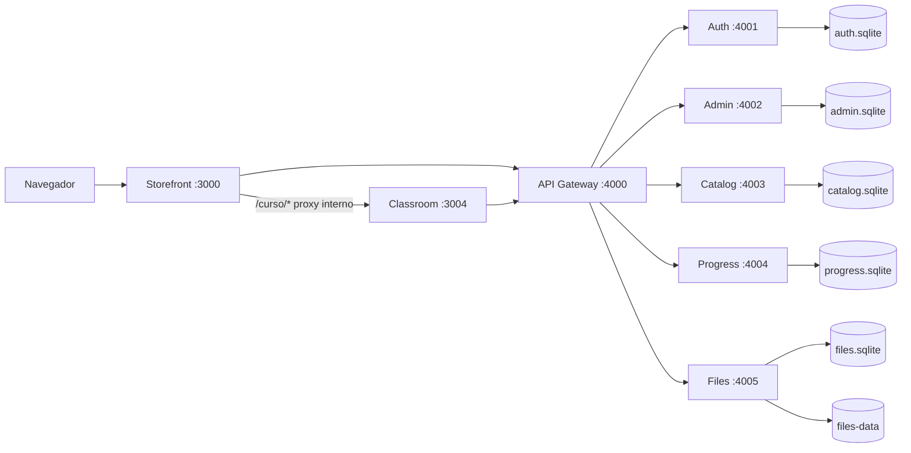
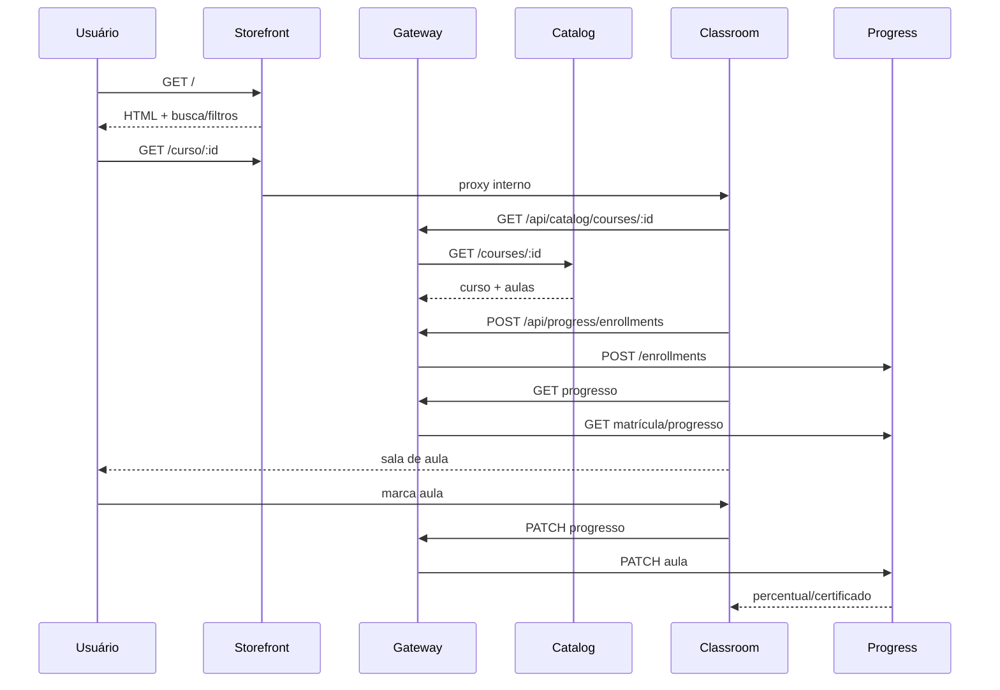

# Arquitetura

Diagramas também estão disponíveis separadamente em [`diagrama-arquitetura.mmd`](diagrama-arquitetura.mmd) e [`diagrama-fluxo-aluno.mmd`](diagrama-fluxo-aluno.mmd).

## Visão geral

O sistema usa um monorepo pnpm/Turborepo, oito aplicações executadas localmente pelo Docker Compose e pacotes compartilhados. Cada domínio backend possui seu processo e seu banco SQLite; o Gateway é a entrada única das APIs.

## Fluxo do catálogo e da sala

## Domínios e persistência

| Serviço | Responsabilidade | Persistência |
|---|---|---|
| Auth | alunos, credenciais, JWT e convites | `auth-data` |
| Admin | solicitações de remoção | `admin-data` |
| Catalog | cursos, aulas e seed | `catalog-data` |
| Progress | matrículas, progresso e certificados | `progress-data` |
| Files | metadados e arquivos | `files-db` + `files-data` |
| Gateway | roteamento HTTP | nenhuma |

Os backends são implementados em **NestJS + TypeScript** (compilados via `tsc` para `dist/`, com o binário SQLite do container para persistência) e os frontends em **Next.js 14 (App Router)**. O Gateway usa o adaptador Express com `bodyParser: false` para encaminhar o corpo bruto (streaming) aos serviços.

## Regras de publicação

1. Professor solicita remoção de um curso.
2. Curso permanece publicado enquanto a solicitação estiver pendente.
3. Administrador aprova ou rejeita.
4. Rejeição exige motivo.
5. Aprovação remove o curso da vitrine e encerra novos acessos.
6. Certificados emitidos permanecem preservados.
